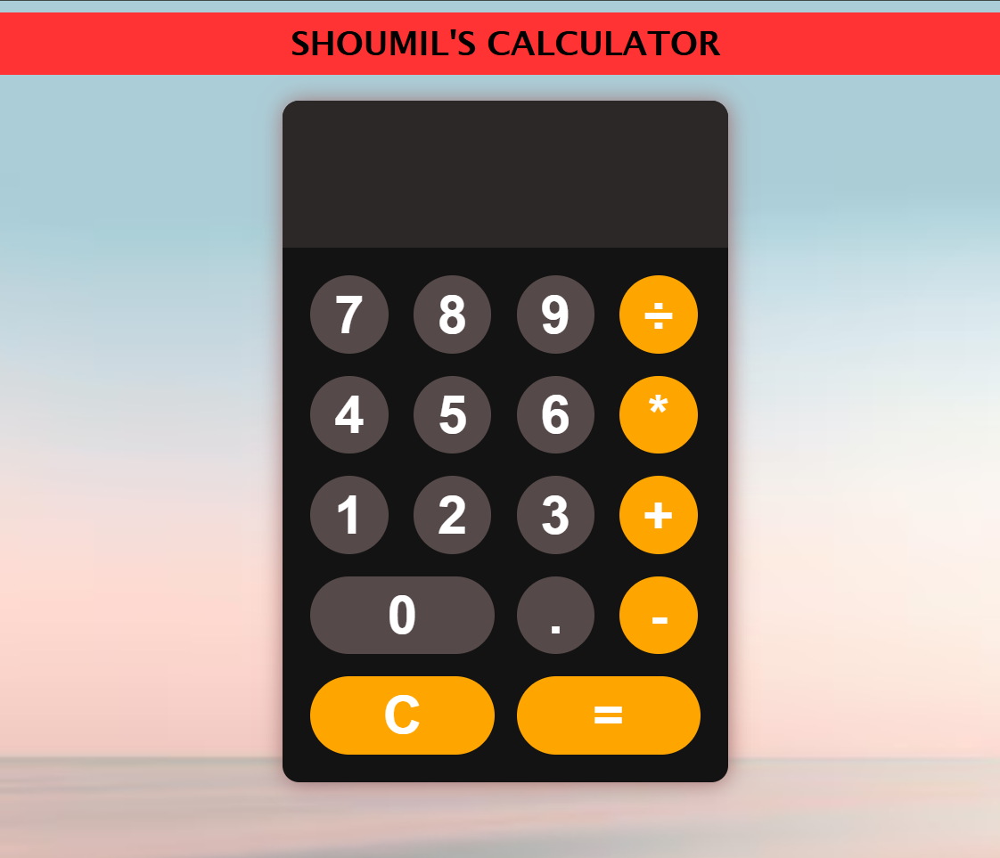

# JS Calculator

A simple, responsive calculator built from scratch using **HTML, CSS, and JavaScript** — no frameworks, no libraries. Built as a hands-on project to practice DOM manipulation, event handling, and layout with Flexbox/Grid.

## Features

- Full number pad with decimal support
- Basic arithmetic operations: addition, subtraction, multiplication, division
- Clear (`C`) button to reset the display
- Live calculation on `=` press
- Error handling for invalid expressions
- Clean, dark-themed UI with rounded buttons and a custom background

## Preview

## Built With

- **HTML5** — structure and markup
- **CSS3** — Flexbox & Grid layout, custom styling, responsive design
- **JavaScript (ES6+)** — DOM manipulation, event listeners, arrow functions

## Project Structure

├── index.html      # Markup for the calculator
├── style.css       # Styling and layout
├── script.js       # Calculator logic and event handling
└── README.md

## Getting Started

No build tools or dependencies needed — it's plain HTML/CSS/JS.

1. Clone the repo:
   \`\`\`bash
   git clone https://github.com/shoum217-cpu/Personal-Calculator.git
   \`\`\`
2. Open \`index.html\` in your browser (or use a tool like VS Code's Live Server extension).
3. Start calculating!

## How It Works

Each button click appends its value to the display using JavaScript's DOM manipulation. Pressing \`=\` evaluates the current expression, and \`C\` clears the display. Event listeners are attached dynamically to number/operator buttons, keeping the logic separate from the markup.

## What I Learned

This project helped me practice:

- Attaching event listeners dynamically with \`querySelectorAll\` and \`forEach\`
- The difference between calling a function immediately vs. passing it as a callback
- Scoping DOM selectors carefully to avoid unintended overlaps
- Structuring CSS with Flexbox and Grid for a centered, responsive layout

## License

This project is open source and available for learning purposes.

